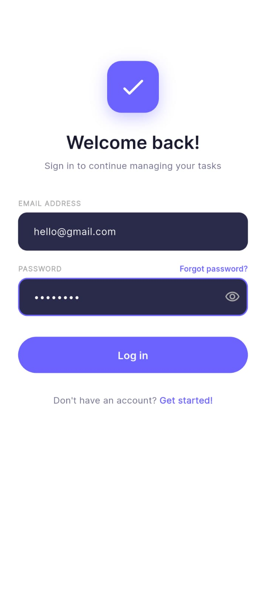
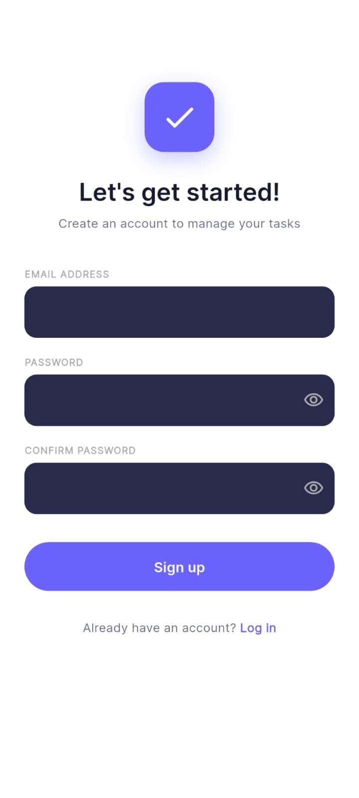
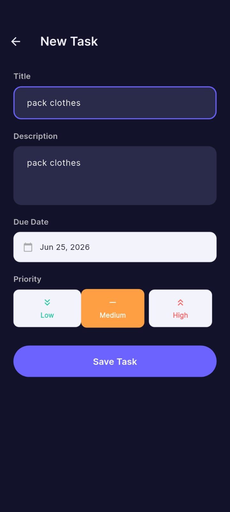
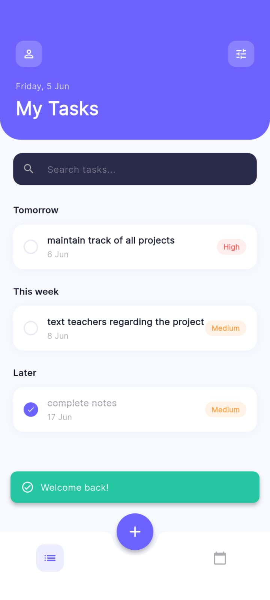
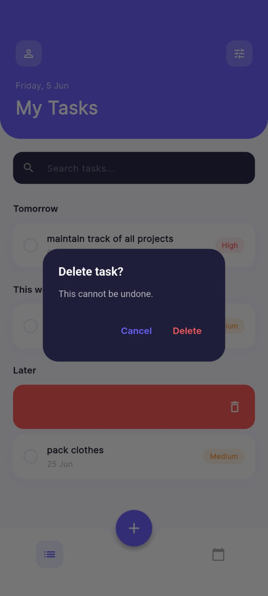

# TaskFlow 🗂️

A task management app for gig workers, built with **Flutter**, **Firebase**, and **Clean Architecture**.

> Built as part of the WhatBytes Flutter Developer Intern assignment.

---
## Live Demo
🌐https://deluxe-daifuku-16c51f.netlify.app

🎥 https://1drv.ms/v/c/e104343f7568cd82/IQDSqyUPPF4zQaCSXO8kKx0sAaPl-X7J0wCvXKGE1m0MYlg?e=bkavF7

## Screenshots

| Login | Home | Add Task | Task Detail |
|-------|------|----------|-------------|
|  |  |  |  | 

---

## Features

- 🔐 Firebase Authentication (register, login, logout, error handling)
- ✅ Create, edit, delete, and view tasks
- 🏷️ Priority levels: Low, Medium, High
- 📅 Due date with overdue highlighting
- 🔄 Mark tasks complete / incomplete
- 🔍 Filter by priority and status (pending / completed)
- 📋 Tasks sorted by due date (earliest first)
- ☁️ Cloud Firestore for real-time data sync
- 🎨 Clean Material Design UI, responsive on Android and iOS

---

## Architecture

TaskFlow follows **Clean Architecture**, separating business logic, data access, and presentation concerns.

| Layer | Responsibility |
|---------|---------------|
| Core | Constants, theme, utilities, shared helpers |
| Data | Models, Firestore data sources, repository implementations |
| Domain | Entities, repository contracts, use cases |
| Presentation | BLoC, screens, widgets, UI logic |

State management is handled using **flutter_bloc**.
Dependency injection uses **get_it + injectable**.
## Tech Stack

| Layer | Technology |
|-------|-----------|
| UI | Flutter + Material 3 |
| State management | flutter_bloc / BLoC pattern |
| Auth | Firebase Authentication |
| Database | Cloud Firestore |
| DI | get_it + injectable |
| Navigation | go_router |
| Architecture | Clean Architecture |

---

## Getting Started

### Prerequisites
- Flutter SDK `>=3.4.0`
- A Firebase project with **Authentication** (email/password) and **Firestore** enabled

### Setup

1. Clone the repo
```bash
   git clone https://github.com/Adithi20122004/TaskFlow_flutter.git
   cd TaskFlow_flutter
```

2. Add your Firebase config files:
   - Android: place `google-services.json` in `android/app/`
   - iOS: place `GoogleService-Info.plist` in `ios/Runner/`

3. Install dependencies and run code generation
```bash
   flutter pub get
   flutter pub run build_runner build --delete-conflicting-outputs
```

4. Run the app
```bash
   flutter run
```

### Firestore Security Rules

Make sure your Firestore rules only allow users to access their own tasks:
```javascript
rules_version = '2';
service cloud.firestore {
match /databases/{database}/documents {
match /tasks/{taskId} {
allow read, write: if request.auth != null
&& request.auth.uid == resource.data.userId;
allow create: if request.auth != null
&& request.auth.uid == request.resource.data.userId;
}
match /users/{userId} {
allow read, write: if request.auth != null
&& request.auth.uid == userId;
}
}
}
```
---

## Project Structure

```text
lib/
├── core/
│   ├── constants/         # App strings, route names, Firestore collection names
│   ├── theme/             # AppTheme, AppColors
│   └── utils/             # Validators, date formatters
├── data/
│   ├── models/            # TaskModel, UserModel
│   └── repositories/      # AuthRepositoryImpl, TaskRepositoryImpl
├── domain/
│   ├── entities/          # TaskEntity, UserEntity
│   ├── repositories/      # Abstract interfaces
│   └── usecases/          # Business logic
└── presentation/
    ├── auth/
    │   ├── bloc/          # AuthBloc, AuthEvent, AuthState
    │   ├── screens/       # LoginScreen, RegisterScreen
    │   └── widgets/       # AuthTextField, etc.
    └── tasks/
        ├── bloc/          # TaskBloc, TaskEvent, TaskState
        ├── screens/       # HomePage, AddTaskPage, TaskDetailPage
        └── widgets/       # TaskCard, FilterChips, PriorityBadge
```
---

## Author

**Adithi**
GitHub: https://github.com/Adithi20122004
